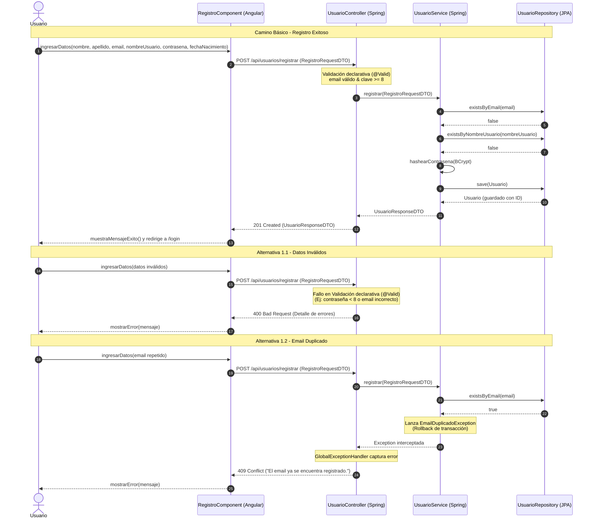

# Diagrama de Secuencia de Diseño: CU-1 Registrarse

```mermaid
sequenceDiagram
    autonumber
    actor U as Usuario
    participant UI as RegistroComponent (Angular)
    participant C as UsuarioController (Spring)
    participant S as UsuarioService (Spring)
    participant R as UsuarioRepository (JPA)

    %% Camino Básico
    Note over U, R: Camino Básico - Registro Exitoso
    U ->> UI: ingresarDatos(nombre, apellido, email, nombreUsuario, contrasena, fechaNacimiento)
    UI ->> C: POST /api/usuarios/registrar (RegistroRequestDTO)
    Note over C: Validación declarativa (@Valid)<br/>email válido & clave >= 8
    C ->> S: registrar(RegistroRequestDTO)
    
    S ->> R: existsByEmail(email)
    R -->> S: false
    S ->> R: existsByNombreUsuario(nombreUsuario)
    R -->> S: false
    
    S ->> S: hashearContrasena(BCrypt)
    S ->> R: save(Usuario)
    R -->> S: Usuario (guardado con ID)
    S -->> C: UsuarioResponseDTO
    C -->> UI: 201 Created (UsuarioResponseDTO)
    UI -->> U: muestraMensajeExito() y redirige a /login

    %% Alternativa 1.1 - Datos inválidos
    Note over U, R: Alternativa 1.1 - Datos Inválidos
    U ->> UI: ingresarDatos(datos inválidos)
    UI ->> C: POST /api/usuarios/registrar (RegistroRequestDTO)
    Note over C: Fallo en Validación declarativa (@Valid)<br/>(Ej: contraseña < 8 o email incorrecto)
    C -->> UI: 400 Bad Request (Detalle de errores)
    UI -->> U: mostrarError(mensaje)

    %% Alternativa 1.2 - Email duplicado
    Note over U, R: Alternativa 1.2 - Email Duplicado
    U ->> UI: ingresarDatos(email repetido)
    UI ->> C: POST /api/usuarios/registrar (RegistroRequestDTO)
    C ->> S: registrar(RegistroRequestDTO)
    S ->> R: existsByEmail(email)
    R -->> S: true
    Note over S: Lanza EmailDuplicadoException<br/>(Rollback de transacción)
    S -->> C: Exception interceptada
    Note over C: GlobalExceptionHandler captura error
    C -->> UI: 409 Conflict ("El email ya se encuentra registrado.")
    UI -->> U: mostrarError(mensaje)
```
