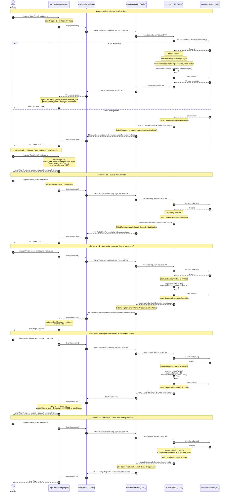

# Diagrama de Secuencia de Diseño: CU-2 Iniciar Sesión (v2)

```mermaid
sequenceDiagram
    autonumber
    actor U as Usuario
    participant UI as LoginComponent (Angular)
    participant SVC as UserService (Angular)
    participant C as UsuarioController (Spring)
    participant S as UsuarioService (Spring)
    participant R as UsuarioRepository (JPA)

    %% Camino Básico
    Note over U, R: Camino Básico - Inicio de Sesión Exitoso
    U ->> UI: ingresarDatos(email, contrasena)
    Note over UI: checkBloqueo() → isBlocked == false
    UI ->> SVC: login(form.value)
    SVC ->> C: POST /api/usuarios/login (LoginRequestDTO)
    C ->> S: iniciarSesion(LoginRequestDTO)
    S ->> R: findByEmail(email.trim().toLowerCase())

    alt email registrado
        R -->> S: Usuario
        Note over S: isActivo() == true
        Note over S: bloqueadoHasta == null o ya expiró
        Note over S: passwordEncoder.matches(contrasena, hash) == true
        S ->> S: setIntentosFallidos(0), setBloqueadoHasta(null)
        S ->> R: save(Usuario)
        R -->> S: Usuario guardado
        S -->> C: UsuarioResponseDTO
        C -->> SVC: 200 OK: UsuarioResponseDTO
        SVC -->> UI: Observable: usuario
        Note over UI: Limpia localStorage (failed_attempts, blocked_until)<br/>guarda umbook_user → navega a /dashboard
        UI -->> U: redirige a /dashboard
    else email no registrado
        R -->> S: Optional vacío
        Note over S: Lanza CredencialesInvalidasException
        S -->> C: CredencialesInvalidasException interceptada
        Note over C: GlobalExceptionHandler.handleCredencialesInvalidas()
        C -->> SVC: 401 Unauthorized: Las credenciales ingresadas no son válidas.
        SVC -->> UI: Observable: error
        UI -->> U: errorMsg = err.error
    end

    %% Alternativa 2.1 - Bloqueo previo en cliente (localStorage)
    Note over U, UI: Alternativa 2.1 - Bloqueo Previo en Cliente (localStorage)
    U ->> UI: ingresarDatos(email, contrasena)
    Note over UI: checkBloqueo():<br/>blocked_until en localStorage aún no expiró<br/>isBlocked = true → return<br/>No se envía llamada HTTP
    UI -->> U: errorMsg: Tu acceso ha sido bloqueado temporalmente...

    %% Alternativa 3.1 - Cuenta deshabilitada
    Note over U, R: Alternativa 3.1 - Cuenta Deshabilitada
    U ->> UI: ingresarDatos(email, contrasena)
    Note over UI: checkBloqueo() → isBlocked == false
    UI ->> SVC: login(form.value)
    SVC ->> C: POST /api/usuarios/login (LoginRequestDTO)
    C ->> S: iniciarSesion(LoginRequestDTO)
    S ->> R: findByEmail(email)
    R -->> S: Usuario
    Note over S: isActivo() == false
    Note over S: Lanza UsuarioDeshabilitadoException
    S -->> C: UsuarioDeshabilitadoException interceptada
    Note over C: GlobalExceptionHandler.handleUsuarioDeshabilitado()
    C -->> SVC: 403 Forbidden: Tu cuenta ha sido deshabilitada.
    SVC -->> UI: Observable: error
    UI -->> U: errorMsg = err.error

    %% Alternativa 4.1 - Contraseña incorrecta (intento < 10)
    Note over U, R: Alternativa 4.1 - Contraseña Incorrecta (Intento menor a 10)
    U ->> UI: ingresarDatos(email, contrasena_incorrecta)
    UI ->> SVC: login(form.value)
    SVC ->> C: POST /api/usuarios/login (LoginRequestDTO)
    C ->> S: iniciarSesion(LoginRequestDTO)
    S ->> R: findByEmail(email)
    R -->> S: Usuario
    Note over S: passwordEncoder.matches() == false
    S ->> S: registrarIntentoFallido()<br/>intentosFallidos = intentosFallidos + 1
    S ->> R: save(Usuario)
    Note over S: Lanza CredencialesInvalidasException
    S -->> C: CredencialesInvalidasException interceptada
    Note over C: GlobalExceptionHandler.handleCredencialesInvalidas()
    C -->> SVC: 401 Unauthorized: Las credenciales ingresadas no son válidas.
    SVC -->> UI: Observable: error
    Note over UI: intentos en localStorage = intentos + 1<br/>(intentos < 10)
    UI -->> U: errorMsg = err.error

    %% Alternativa 4.2 - Bloqueo de cuenta en servidor (décimo intento fallido)
    Note over U, R: Alternativa 4.2 - Bloqueo de Cuenta (Décimo Intento Fallido)
    U ->> UI: ingresarDatos(email, contrasena_incorrecta)
    UI ->> SVC: login(form.value)
    SVC ->> C: POST /api/usuarios/login (LoginRequestDTO)
    C ->> S: iniciarSesion(LoginRequestDTO)
    S ->> R: findByEmail(email)
    R -->> S: Usuario
    Note over S: passwordEncoder.matches() == false
    S ->> S: registrarIntentoFallido()<br/>intentosFallidos = 10<br/>setBloqueadoHasta(now + 1 hora)
    S ->> R: save(Usuario)
    Note over S: Lanza CredencialesInvalidasException
    S -->> C: CredencialesInvalidasException interceptada
    C -->> SVC: 401 Unauthorized
    SVC -->> UI: Observable: error
    Note over UI: intentos locales = 10<br/>guarda blocked_until = Date.now() + 3600000 en localStorage
    UI -->> U: errorMsg: Tu acceso ha sido bloqueado temporalmente...

    %% Alternativa 5.1 - Cuenta ya bloqueada en servidor
    Note over U, R: Alternativa 5.1 - Intento en Cuenta Bloqueada (Servidor)
    U ->> UI: ingresarDatos(email, contrasena)
    UI ->> SVC: login(form.value)
    SVC ->> C: POST /api/usuarios/login (LoginRequestDTO)
    C ->> S: iniciarSesion(LoginRequestDTO)
    S ->> R: findByEmail(email)
    R -->> S: Usuario
    Note over S: bloqueadoHasta != null &&<br/>bloqueadoHasta.isAfter(LocalDateTime.now())
    Note over S: Lanza UsuarioBloqueadoException
    S -->> C: UsuarioBloqueadoException interceptada
    Note over C: GlobalExceptionHandler.handleUsuarioBloqueado()
    C -->> SVC: 429 Too Many Requests: Tu cuenta fue bloqueada.
    SVC -->> UI: Observable: error
    UI -->> U: errorMsg = err.error
```
