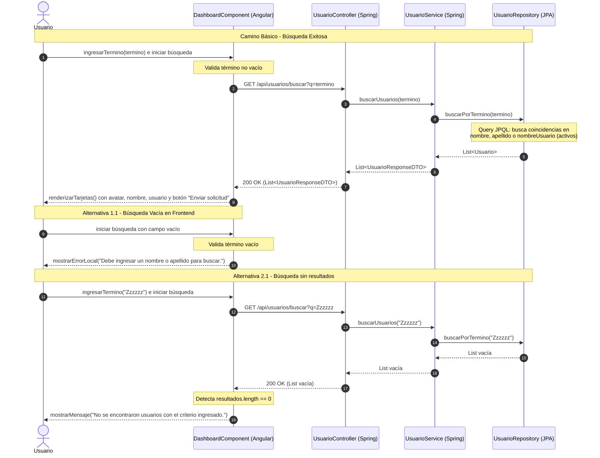

# Diagrama de Secuencia de Diseño: CU-7 Buscar Usuarios ()

```mermaid
sequenceDiagram
    autonumber
    actor U as Usuario
    participant UI as DashboardComponent (Angular)
    participant C as UsuarioController (Spring)
    participant S as UsuarioService (Spring)
    participant R as UsuarioRepository (JPA)

    %% Camino Básico
    Note over U, R: Camino Básico - Búsqueda Exitosa
    U ->> UI: ingresarTermino(termino) e iniciar búsqueda
    Note over UI: Valida término no vacío
    UI ->> C: GET /api/usuarios/buscar?q=termino
    C ->> S: buscarUsuarios(termino)
    
    S ->> R: buscarPorTermino(termino)
    Note over R: Query JPQL: busca coincidencias en<br/>nombre, apellido o nombreUsuario (activos)
    R -->> S: List<Usuario>
    
    S -->> C: List<UsuarioResponseDTO>
    C -->> UI: 200 OK (List<UsuarioResponseDTO>)
    UI -->> U: renderizarTarjetas() con avatar, nombre, usuario y botón "Enviar solicitud"

    %% Alternativa 1.1 - Búsqueda vacía
    Note over U, UI: Alternativa 1.1 - Búsqueda Vacía en Frontend
    U ->> UI: iniciar búsqueda con campo vacío
    Note over UI: Valida término vacío
    UI -->> U: mostrarErrorLocal("Debe ingresar un nombre o apellido para buscar.")

    %% Alternativa 2.1 - Búsqueda sin resultados
    Note over U, R: Alternativa 2.1 - Búsqueda sin resultados
    U ->> UI: ingresarTermino("Zzzzzz") e iniciar búsqueda
    UI ->> C: GET /api/usuarios/buscar?q=Zzzzzz
    C ->> S: buscarUsuarios("Zzzzzz")
    S ->> R: buscarPorTermino("Zzzzzz")
    R -->> S: List vacía
    S -->> C: List vacía
    C -->> UI: 200 OK (List vacía)
    Note over UI: Detecta resultados.length == 0
    UI -->> U: mostrarMensaje("No se encontraron usuarios con el criterio ingresado.")
```
