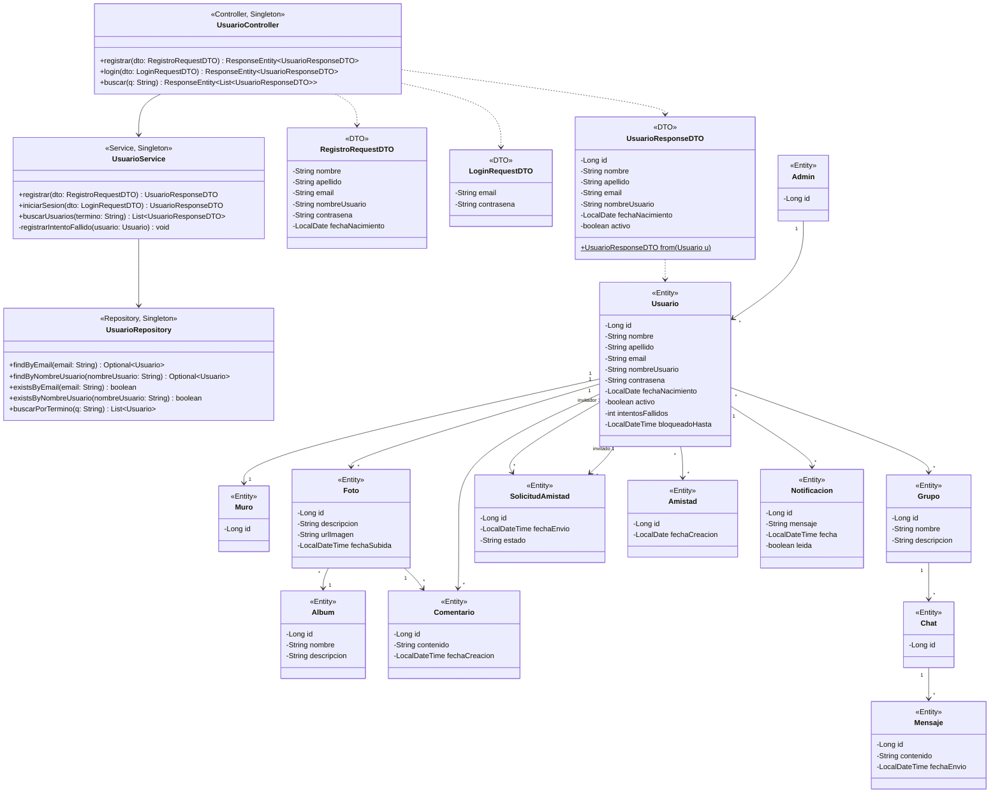

# Diagrama de Clases de Diseño — Backend (Spring Boot)

> **Clases implementadas** (con detalle completo): `Usuario`, `UsuarioController`, `UsuarioService`, `UsuarioRepository` y los tres DTOs.
> **Entidades no implementadas**: se incluyen con sus atributos del modelo de dominio; verificar contra el diagrama de análisis original.

