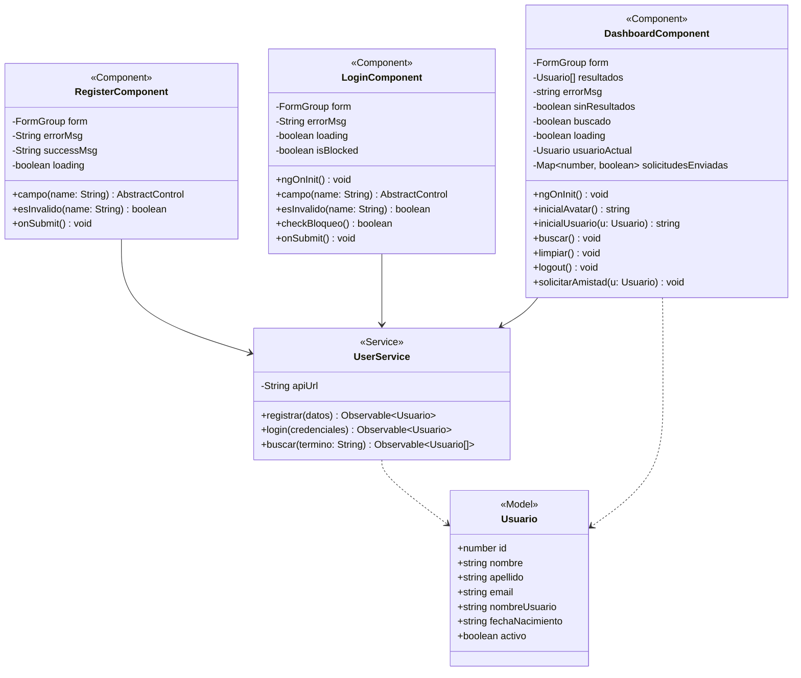

# Diagrama de Clases de Diseño — Frontend (Angular) (v2)

> Solo se documentan las clases implementadas.

```mermaid
classDiagram
    direction TB

    class UserService {
        <<Service>>
        -String apiUrl
        +registrar(datos) Observable~Usuario~
        +login(credenciales) Observable~Usuario~
        +buscar(termino: String) Observable~Usuario[]~
    }

    class RegisterComponent {
        <<Component>>
        -FormGroup form
        -String errorMsg
        -String successMsg
        -boolean loading
        +campo(name: String) AbstractControl
        +esInvalido(name: String) boolean
        +onSubmit() void
    }

    class LoginComponent {
        <<Component>>
        -FormGroup form
        -String errorMsg
        -boolean loading
        -boolean isBlocked
        +ngOnInit() void
        +campo(name: String) AbstractControl
        +esInvalido(name: String) boolean
        +checkBloqueo() boolean
        +onSubmit() void
    }

    class DashboardComponent {
        <<Component>>
        -FormGroup form
        -Usuario[] resultados
        -string errorMsg
        -boolean sinResultados
        -boolean buscado
        -boolean loading
        -Usuario usuarioActual
        -Map~number, boolean~ solicitudesEnviadas
        +ngOnInit() void
        +inicialAvatar() string
        +inicialUsuario(u: Usuario) string
        +buscar() void
        +limpiar() void
        +logout() void
        +solicitarAmistad(u: Usuario) void
    }

    class Usuario {
        <<Model>>
        +number id
        +string nombre
        +string apellido
        +string email
        +string nombreUsuario
        +string fechaNacimiento
        +boolean activo
    }

    RegisterComponent --> UserService
    LoginComponent --> UserService
    DashboardComponent --> UserService
    UserService ..> Usuario
    DashboardComponent ..> Usuario
```
